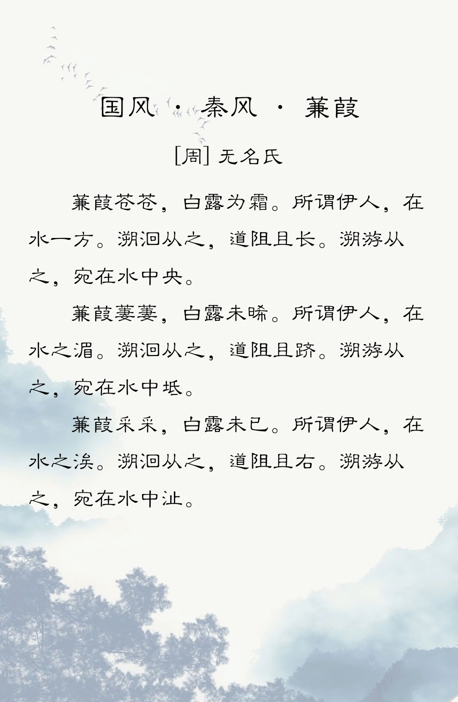

  

# 蒹葭

## Introduction
后端采用：SpringBoot（完成了一部分。）

前端采用：VUE（目前正在学习中......）

## Reference
[The GitHub Blog: Generate new repositories with repository templates](https://github.blog/2019-06-06-generate-new-repositories-with-repository-templates/)

## License
 This work is licensed under a <a rel="license" href="http://creativecommons.org/licenses/by-sa/4.0/">Creative Commons Attribution-ShareAlike 4.0 International License</a>.